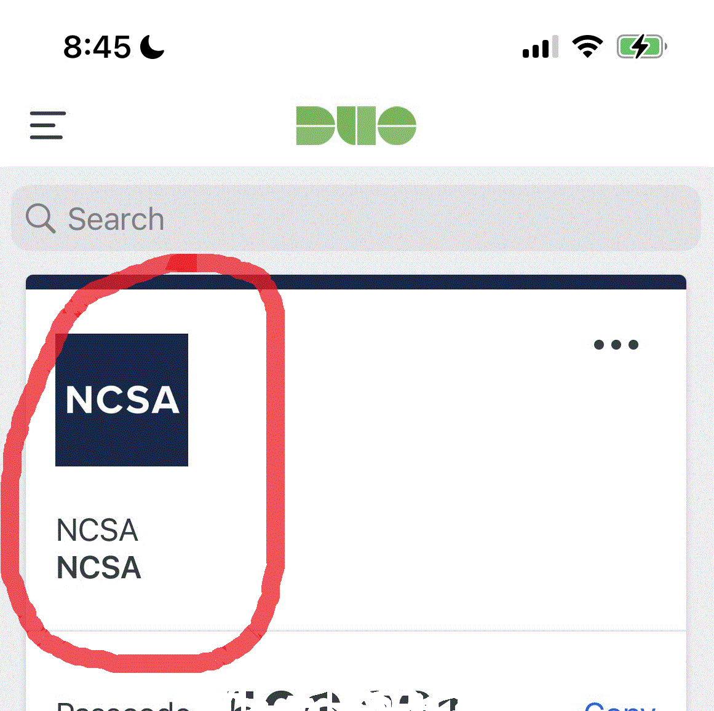

########################
Logging Onto Nightingale
########################

Once you have obtained an account on Nightingale, you can log on using an SSH (Secure Shell) client on your local desktop or laptop. 
Because of the added security for Nightingale, you will first log onto Nightingale's secure node and then log onto a general access login node 
or, for groups that have them, a specialized interactive node. The hostnames for these login nodes are listed below.

**Secure Node Hostname**::

   ngale-bastion-1.ncsa.illinois.edu 

**General Access Login Nodes Hostnames**::

   ng-login01.ngale.internal.ncsa.edu
   ng-login02.ngale.internal.ncsa.edu

**Specialized Interactive Node Hostname**::

   ng-<yourgroup>01.ngale.internal.ncsa.edu

where ng-<yourgroup>01 is the name of your allocation group. 

**Notes:** 

- Your principal investigator can inform you if your allocation has a specialized interactive node and its hostname.
- All Nightingale users have access to the general access login nodes. Please be aware that these nodes are a shared resource for all 
  system users, and you should limit your use of them to editing, compiling, and building your programs.

**General Log in Process**

You can log onto Nightingale by following these steps:

1. If not on campus, connect to the campus VPN. (`Instructions for installing the campus VPN <https://answers.uillinois.edu/illinois/98773>`_)
2. SSH to the secure node ngale-bastion-1.ncsa.illinois.edu.
3. Enter your NCSA username and password.
4. Enter '1' to send a push to the Duo app on your smartphone.
5. Approve the request on your phone.
6. SSH to your login node using the appropriate hostname (see above).

Below is a sample SSH command line to log into Nightingale's secure node where <username> is the username you created for your NCSA identity.::

   ssh <username>@ngale-bastion-1.ncsa.illinois.edu

After entering the ssh command, you will be prompted to enter your password, followed by a prompt to send a push to the Duo app (both of which you will not see on the screen). After you have approved the push, you will be at a prompt on ngale-bastion-1 node that will look something like this: 

.. 

   [csteffen@ngale-bastion-1 ~]$

At that prompt, enter an SSH command using the hostname of your login node:

.. 

   ssh <your_username>@ng-<yourgroup>01
   
so for example, if your username is "hirop" and you group name is "biology" then your final ssh command might look like this:

.. 

   ssh hirop@ng-biology03
   
In this case, you would been specifically told that "ng-biology03" would be your node to use for your computations.

The two commands above can be combined into one by specifying the bastion host as a "jump" host. The jump host is used to connect you to your destination node without you needing to interact with it. In this example, user "test1" can log into the Nightingale login node "login01" directly without logging into the bastion host first.

.. 

   ssh -J test1@ngale-bastion-1.ncsa.illinois.edu test1@ng-login01

**Note on Duo**

You must have an "NCSA" entry in your Duo app as follows.  A "University of Illinois" Duo entry will not get you into Nightingale.  

**Passwords**

When typing passwords into terminals, you *will not see the characters you type*.  That is, you will type your password and hit enter then type "1" to send the push to your phone, without seeing what you type on the screen.  

Also, when setting up your NCSA ID password (also called kerberos password), you may want to use a password you can easily type. There are sometimes issues with copying and pasting passwords from a password manager (or document on your own computer) making it seem like you have entered the wrong password.
