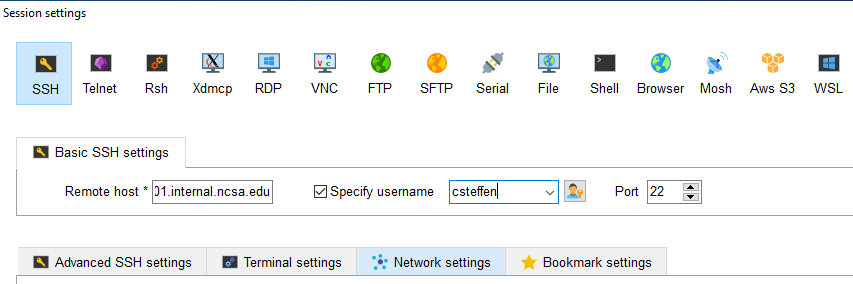
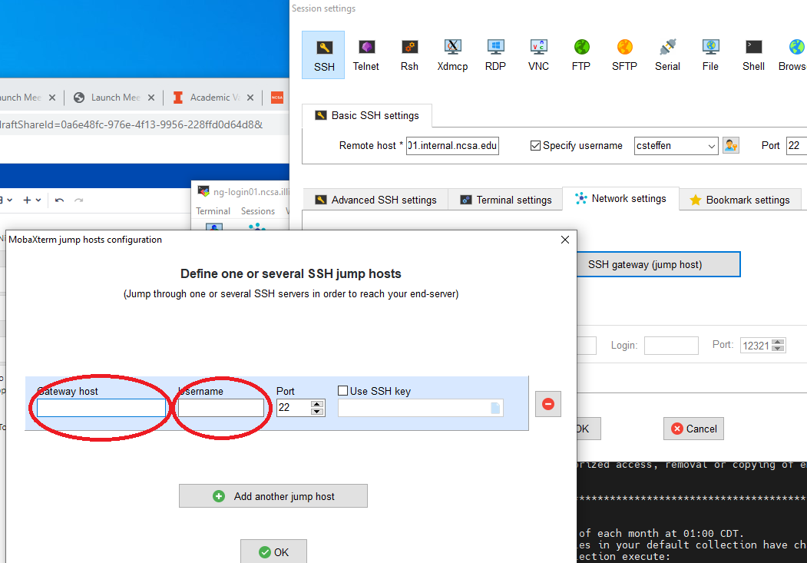

=========================
Connecting with MobaXterm
=========================

The Moba Xterm application runs on your computer and connects it to a
Nightingale node, and allows you to run software as if your screen,
mouse, and keyboard were attached directly to that node of Nightingale.
The Nightingale cluster has extra security to protect the data on it, so
configuring this connection is slightly more complicated than some other
connections. The good news is, once you have this set up, it's easy to
use.

You will need to have administrative privileges on your machine to
install Moba Xterm. If you don't have that, you will need to have
someone install Moba Xterm for you. They can follow these instructions.

| Download Moba Xterm from this page:
  https://mobaxterm.mobatek.net/download-home-edition.html
| The best version is the "previous stable version" that's
  non-"portable" version.  Click on that button to download the .zip file.
  Once you have it, right click on the zip file, click on option
  "extract all", and choose a location. Then open up that folder, which
  will contain two files, one of which is a .msi file which is a Windows
  installer file. Double-click on the msi file, which will launch the
  Windows install Wizard. You'll need to accept the terms of service.
  It's fine to keep hitting "next". Installing in the default location
  is fine. You will probably need to authorize "MobaXterm installer" to
  make changes to your device. Allow this.

When you start Moba Xterm for the first time, you may get a warning from
"Windows Defender Firewall" saying it has blocked access for the
application "xwin_mobax". Go ahead and click all the boxes and then
click the "Allow access" button. (Most applications work locally, so if
they're trying to reach out over the network, something fishy is going
on. The whole point of Moba Xterm is that it connects to another
computer over the network. That's how it works. Nothing fishy here.)

**Initial Moba Xterm test**
---------------------------

Before you use these instructions, make sure you know what hostname
within the Nightingale cluster you need to log into. This is explained
in the previous section.

Open up the Moba Xterm application. Click the button in the middle of
the main window called "Start Local Terminal" to open up a new
connection. You will have a colorful window that has a prompt at the
bottom that allows you to type commands. The last part of the prompt
will probably be something like "/home/mobaxterm". To test that
everything is working, please type the following, all on one line. While
you're typing, substitute the hostname of **your** nightingale node for
"XXXXX", and substitute **your** NCSA identity username for "UUUUU".

::

   ssh -J UUUUU@ngale-bastion-1.ncsa.illinois.edu UUUUU@XXXXX.internal.ncsa.edu
   

so with the proper substitutions, if fictional user Hiro P. were using
this method to log into (fictional) Nightingale node "beatlesGPU02",
they would type the following:

::

   ssh -J hirop@ngale-bastion-1.ncsa.illinois.edu hirop@beatlesGPU02.internal.ncsa.edu
   

The text will ask you for your password. Type in your NCSA kerberos
password (YOU WILL NOT SEE THE CHARACTERS AS YOU TYPE. JUST TYPE IT
BLINDLY). Then it will ask you for a Duo code. Type "1", hit return,
your Duo device (usually your phone) will notify you of the request,
approve the connection on your Duo device. Then it will ask you for your
password again. Type it again, and again you won't see the characters.

Then you will be back at a prompt, but unlike before, the prompt will be
to execute commands on a node of Nightingale (rather than your own
computer). If it worked, the prompt you see will look something like
this, with the name of the node you logged into displayed as part of the
prompt:

::

   [UUUUU@XXXXX ~]$ 
   
So if fictional user "Hiro P." logs into the same (fictional) node as
above, it would look like this:

::

   [hirop@beatlesGPU02 ~]$ 
   

If you see this, that means you can successfully log into your node on
Nightingale. However, now you need to test that you can bring an
application window from Nightingale to your machine. Type "xclock" and
then hit return. If it immediately complains about something like
"DISPLAY not set", then something's wrong. In around about 10 seconds or
so, a square window with a running analog clock should show up on your
desktop. (Check your window bar if you don't see it; sometimes it hides
behind other windows.)

If that worked, you're all set. You just need to type that ssh line from
above to log into Nightingale to work. To make logging in simpler, and
enable moving files to Nightingale, configure Moba Xterm per the
following section.

Configuring Moba Xterm
------------------------------

Once you know that logging in works, you should configure Moba Xterm as
follows.

Click on the "Session" button near the upper left of the Moba Xterm
window.

..  image:: ./ng_mxt_session_button.gif

This brings up a "Session settings" window. Click "SSH" in the very
upper left corner of that window.

..  image:: ./XC_01_select_ssh.png

This will populate the lower part of the window. Insert **the name of
your interactive node** into the "Remote host" blank. Click on "specifiy
username" as below. The username will have "<default"> in the blank, as
here:

..  image:: ./XC_specify_host_username.png

Replace <default> with your own username. This is what it looks like,
using my username "csteffen":

In the lower part of the window, click on the "Network settings" tab.
Once there, click "SSH gateway (jump host" in the middle.

..  image:: ./XC_network_settings.png

This will bring up yet another configuration window. Put
"ngale-bastion-1.ncsa.illinois.edu" in the "Gateway host" box (no matter
what Nightingale host you're logging into; all access goes through the
bastion host node: Put your NCSA username in the "Username" box.

so that it looks like this:

..  image:: ./XC_jump_host_filled_in.png

Then click "Ok". Back in the Session settings, now click "OK" at the
bottom. This should open a new tab in your overall Moba Xterm window
that will log into your interactive node on Nightingale.
