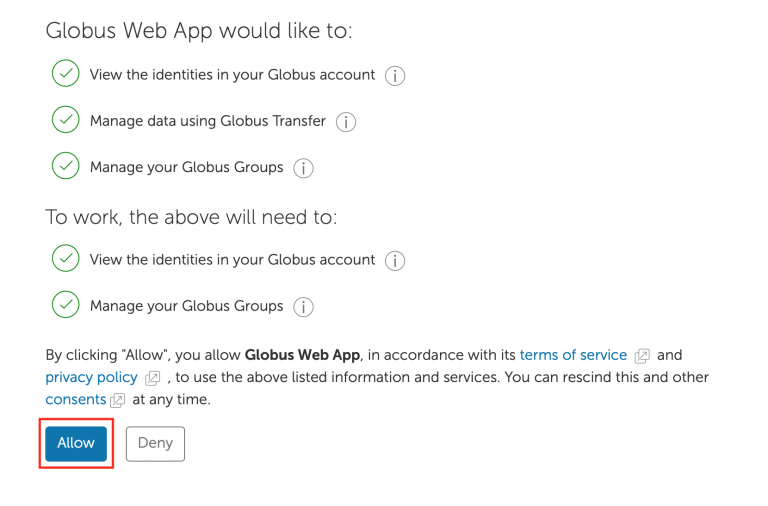
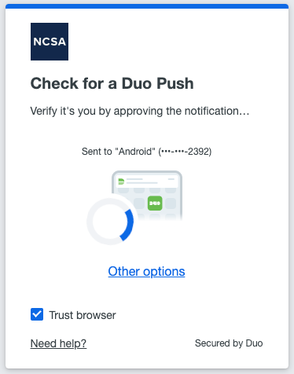
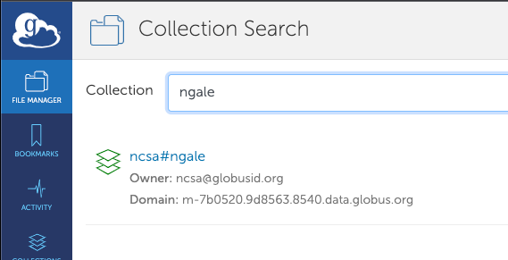
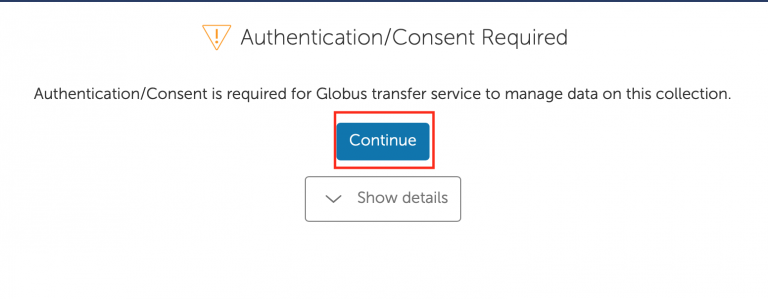
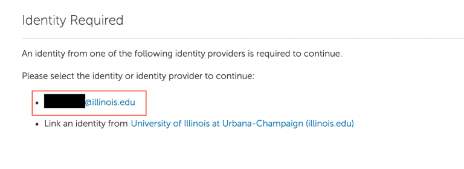
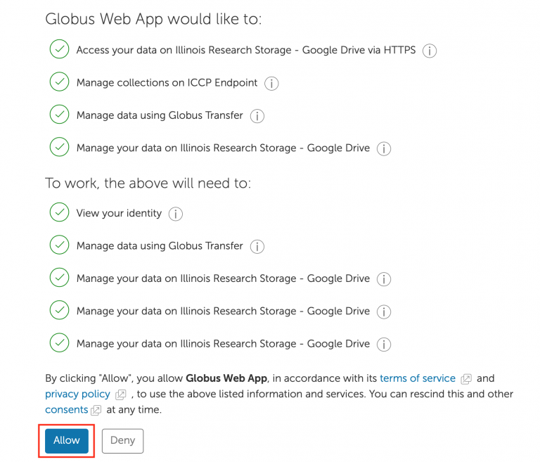
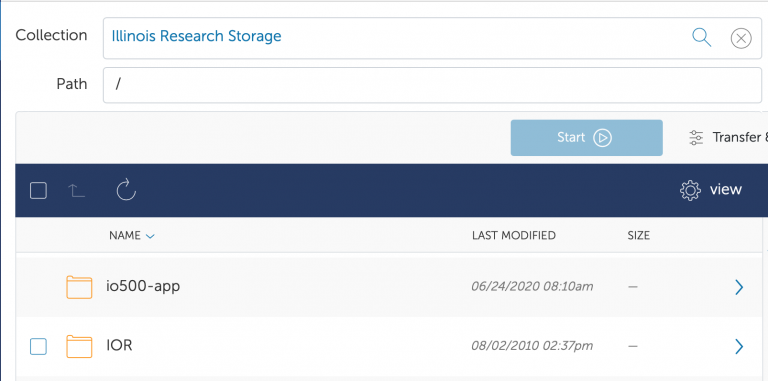
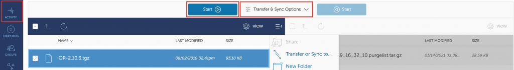

.. warning::

   As of January 2023, Globus is now available for use on Nightingale.  However, we have not finished the final contracts and setup for specifically HIPAA-data certified variant of globus, so do not transfer HIPAA data over globus at this time.  When HIPAA-certified Globus is installed, this warning will be removed.  If you have any questions about data movement, please don't hesitate to put in a ticket (:ref:`help`).  

File Transfers with Globus
-----------------------------

Globus is a web-based file transfer system that works in the background to move files between systems with "Globus Endpoints".  Nightingale will have a permanent Globus Endpoint (with a name announced at that time).  To transfer files to and from your directories using Globus, you will have to authenticate that endpoint, using your already-existing NCSA username, password, and NCSA account on Duo. 

One-time Setup
~~~~~~~~~~~~~~~~

You will need to set up a separate account on globus.org, that will have a username and a separate password.  To use Globus to transfer files to and from Nightingale, you will need to "link" your new Globus account with your NCSA identity.  Log into globus.org, click on "Account" in the left sidebar, then click on the "Identities" tab.  If your NCSA username and email address is not in that list, then click "Link Another Identity" in the upper right to link it.

Using Globus to Transfer Files
~~~~~~~~~~~~~~~~~~~~~~~~~~~~~~~~~~~

Once your identity is linked (above) then do the following to transfer files using Globus.

Navigate to globus.org and click “Log In” in the upper right corner

We recommend you use an independent password for your globus account.  If you're doing that, on the "Log in to use Globus Web App" screen, click on "Globus ID to sign in" at the very bottom, and sign in with your globus password.  

If prompted click “Allow” when asked to authorized the Globus Web App

Login in via the Illinois Shibboleth service, this will be a Duo 2FA prompt

Once logged in you should be taken to the File Manager section, on one side search for "ngale" and click on the "ncsa#ngale" endpoint from the resulting list:

The system will prompt you to Authenticate to the endpoint, click continue; Globus may prompt you to link your netid@illinois.edu identity, go ahead and do so

You should then get dropped back into the “File Manger” view and be able to see your home directory in the explorer window

Then in a similar manner (in the right half of the “File Manger” view) search for and authenticate to the collection you are planning to transfer data to/from, then use the GUI to transfer the data; you can choose transfer settings. Also on the left is a button to view your current transfer activity

