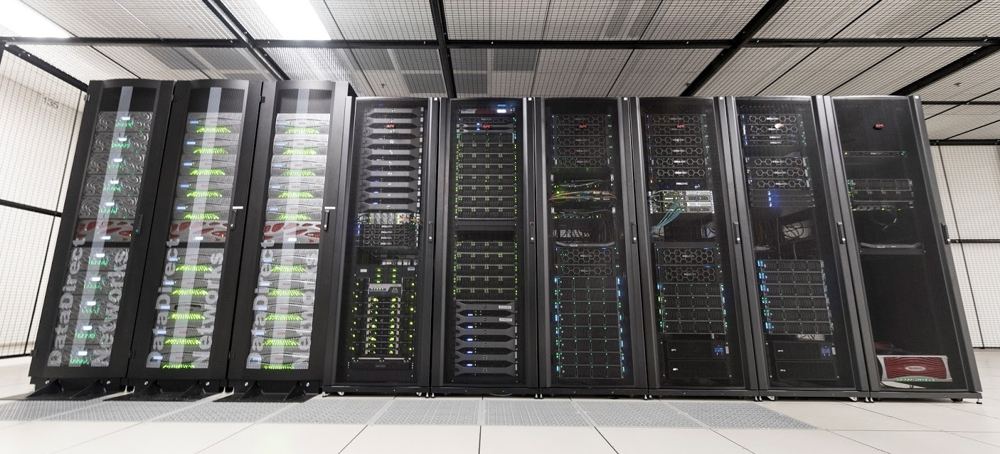

#####################################
Nightingale User Documentation
#####################################

Introduction
=============

**Nightingale** is a high-performance compute cluster for sensitive data offering researchers a secure system for data storage and powerful computation. NCSA experts manage the complex requirements surrounding sensitive data, taking the burden off the user so they can focus on their research. The system complies with the Health Insurance Portability and Accountability Act (HIPAA) privacy and security rules for using Protected Health Information (PHI). Nightingale is not limited to the health domain and accommodates projects that require this amount of security or less, such as compliance with Controlled Unclassified Information (CUI) policies. 

The Nightingale cluster resides in the NCSA National Petascale Computing Facility and is audited yearly by an outside entity to ensure secure operation (SOC 2 Type 2). It is available for a fee to University of Illinois faculty, staff, students, and their collaborators through desktop access and encrypted laptop access. Rates are based on a service model that provides flexibility for short-term and long-term projects. If this level of security is not needed, please consider other `NCSA resources <https://www.ncsa.illinois.edu/expertise/compute-resources/computing-systems-and-services>`_.

Getting Started with High-Performance Computing
=================================================

**There are no specific prerequisite courses or high-performance computing (HPC) experience required before using Nightingale**. However, if you are unfamiliar with using an HPC cluster, it is highly recommended that you take NCSA’s short tutorial `Using an HPC Cluster for Scientific Applications <https://www.hpc-training.org/moodle/course/view.php?id=71>`_ before continuing.

Browse NCSA’s `HPC-Moodle <https://www.hpc-training.org>`_ for a full list of HPC training opportunities including self-paced tutorials and training events (in-person and virtual).

=======================

.. toctree::
   :maxdepth: 2
   :hidden:

   status_updates
   quick_start
   faq
   help

.. toctree::
   :maxdepth: 2
   :caption: User Guide

   user_guide/architecture
   user_guide/fee_overview
   user_guide/groups_accounts
   user_guide/accessing/index
   user_guide/file_mgmt
   user_guide/software
   user_guide/programming_environment
   user_guide/running_jobs
   user_guide/visualization
   user_guide/containers
   user_guide/citizenship
   user_guide/protected_data
