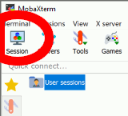
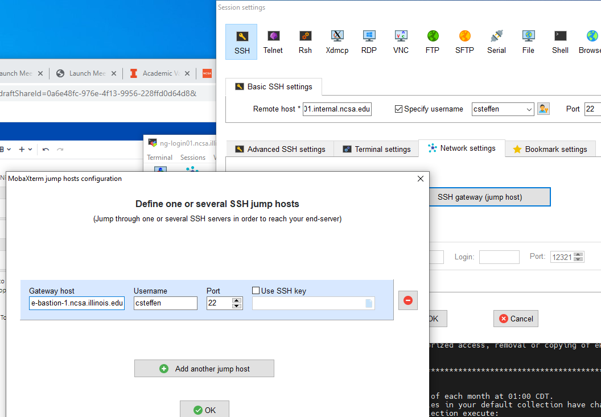

#########################
Connecting with MobaXterm
#########################

You can install `MobaXterm <https://mobaxterm.mobatek.net/>`_ on your 
workstation and use it to connect to Nightingale node using SSH. MobaXterm 
enables an SSH connection and provides other useful utilities you can use 
when communicating with a cluster, such as file transfer and editing.

Follow the steps below to install MobaXterm and connect to Nightingale. (Nightingale has extra security to protect the data stored on it, so configuring this connection is slightly more complicated than other HPC clusters. The difference involves adding the SSH connection to the secure bastion node. How to do this is described in Step 6.)

**Step 1.** `Download MobaXterm <https://mobaxterm.mobatek.net/download-home-edition.html>`_ and install it on your Windows workstation. 

You can install either the Portable or Installer edition of MobaXterm. You will need to have admin privileges to install the Installer edition. The Portable edition does not require admin privileges and to use it just extract the downloaded zip file and click mobaxterm.exe.

**Step 2.** Launch the MobaXterm application and click the 'Session' button in the upper left of the window to start an SSH session.

**Step 3.** Select 'SSH' from the session types displayed and click the 'OK' button. 

..  image:: ./XC_01_select_ssh.png

**Step 4.** You will now see an area titled 'Basic SSH Settings.' 

..  image:: ./XC_specify_host_username.png

**Step 5.** In the remote host text box, enter the name of the login node you want to access (either a general access or interactive node). Then check the box 'Specify username' and enter your NCSA Identity username as shown in the following example. 

..  image:: ./XC_specify_host_username2.png

**Step 6.** Next, click the "Network settings" tab and then click the "SSH gateway (jump host)" button.

..  image:: ./XC_network_settings.png

**Step 7.** In the configuration window displayed, enter 
"ngale-bastion-1.ncsa.illinois.edu" in the "Gateway host" box and your NCSA username in the "Username" box. Then click the 'OK' button. (You may see a warning message saying that your remote host identification has changed. Go ahead and click the Yes button to continue.)

**Step 8.** You should now be back in the Session settings window. Click the 'OK' button to initiate your SSH connection. A terminal window will be displayed asking for your password. Enter your password and press return.
