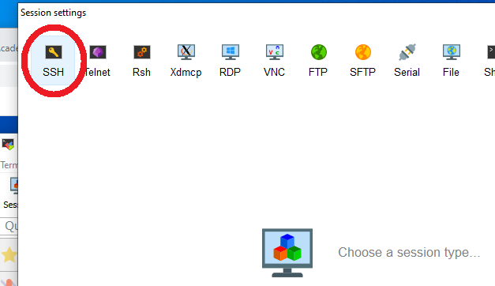
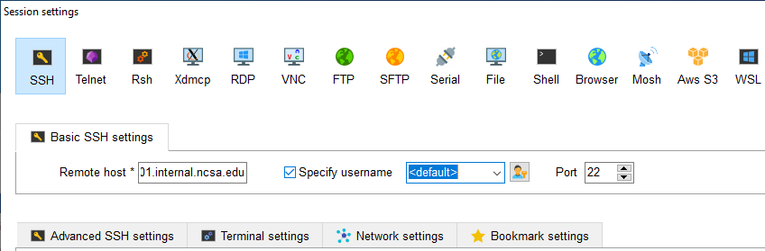
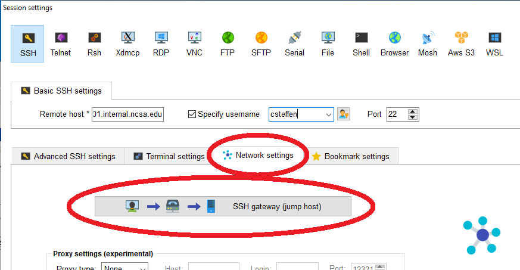
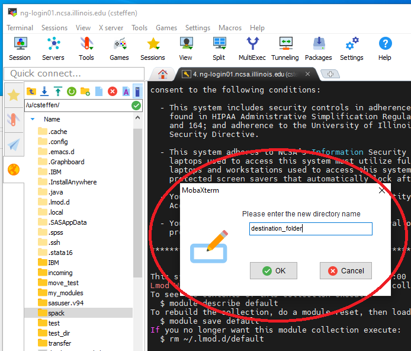
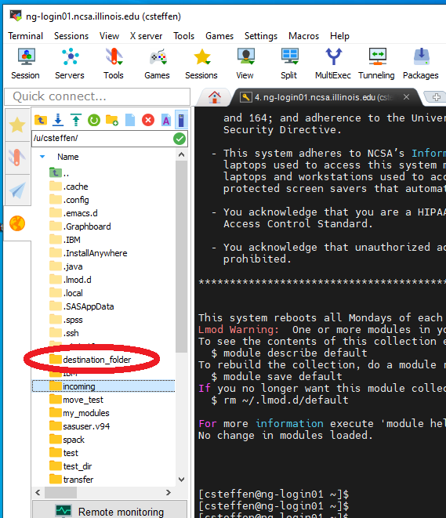
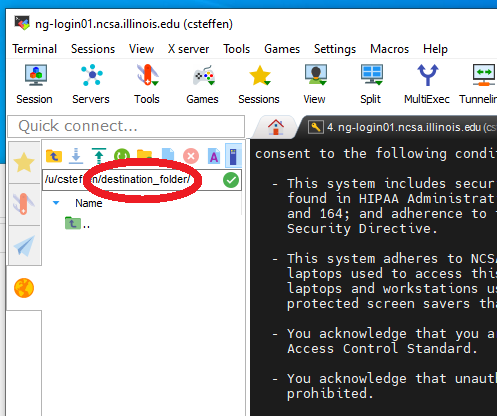
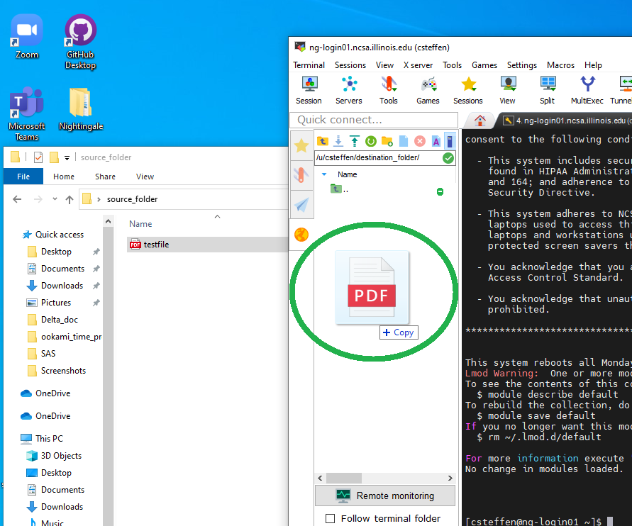

***************
Using MobaXterm
***************

Installing MobaXterm
---------------------
The Moba Xterm application runs on your computer and connects it to a
Nightingale node, and allows you to run software as if your screen,
mouse, and keyboard were attached directly to that node of Nightingale.
The Nightingale cluster has extra security to protect the data on it, so
configuring this connection is slightly more complicated than some other
connections. The good news is, once you have this set up, it's easy to
use.

You will need to have administrative privileges on your machine to
install Moba Xterm. If you don't have that, you will need to have
someone install Moba Xterm for you. They can follow these instructions.

| Download Moba Xterm from this page:
  https://mobaxterm.mobatek.net/download-home-edition.html
| The best version is the "previous stable version" that's
  non-"portable" version.  Click on that button to download the .zip file.
  Once you have it, right click on the zip file, click on option
  "extract all", and choose a location. Then open up that folder, which
  will contain two files, one of which is a .msi file which is a Windows
  installer file. Double-click on the msi file, which will launch the
  Windows install Wizard. You'll need to accept the terms of service.
  It's fine to keep hitting "next". Installing in the default location
  is fine. You will probably need to authorize "MobaXterm installer" to
  make changes to your device. Allow this.

When you start Moba Xterm for the first time, you may get a warning from
"Windows Defender Firewall" saying it has blocked access for the
application "xwin_mobax". Go ahead and click all the boxes and then
click the "Allow access" button. (Most applications work locally, so if
they're trying to reach out over the network, something fishy is going
on. The whole point of Moba Xterm is that it connects to another
computer over the network. That's how it works. Nothing fishy here.)

Configuring Moba Xterm
------------------------------

Once you know that logging in works, you should configure Moba Xterm as
follows.

Click on the "Session" button near the upper left of the Moba Xterm
window.

..  image:: ../../user_guide/images/accessing/ng_mxt_session_button.gif

This brings up a "Session settings" window. Click "SSH" in the very
upper left corner of that window.

This will populate the lower part of the window. Insert **the name of
your interactive node** into the "Remote host" blank. Click on "specifiy
username" as below. The username will have "<default"> in the blank, as
here:

Replace <default> with your own username. This is what it looks like,
using my username "csteffen":

..  image:: ../../user_guide/images/accessing/XC_specify_host_username2.png

In the lower part of the window, click on the "Network settings" tab.
Once there, click "SSH gateway (jump host" in the middle.

This will bring up yet another configuration window. Put
"ngale-bastion-1.ncsa.illinois.edu" in the "Gateway host" box (no matter
what Nightingale host you're logging into; all access goes through the
bastion host node: Put your NCSA username in the "Username" box.

..  image:: ./XC_jump_host_username.png

so that it looks like this:

..  image:: ../../user_guide/images/accessing/XC_jump_host_filled_in.png

Then click "Ok". Back in the Session settings, now click "OK" at the
bottom. This should open a new tab in your overall Moba Xterm window
that will log into your interactive node on Nightingale.

Moving files to Nightingale 
---------------------------

You may have files on your local system that you want to transfer to
Nightingale to use. These may be data files, or configuration program
files, or test files. Once you're logged in to Nightingale on Moba
Xterm, you can use Moba Xterm to transfer those files, just as if you
were copying them around your local machine.

Here, I'm starting with a test file on my local system:

..  image:: ../../under_review/mobaxterm/XF_original_file_in_folder.png

The file is called "testfile.pdf" and it's it' folder "source_folder" on
my desktop.

Then open up Moba Xterm, and log into your node on Nightingale. if
you've set up the login configuration correctly (see the configuration
section above) then the left part of your Moba Xterm winodow will be a
list of folders and files, and the pathname of the folder will end with
**your** Nightingale username (circled in red) and a slash "/", as
below. If you don't see this, then something is configured wrong and
you'll have to back up.

..  image:: ../../under_review/mobaxterm/XF_logged_in.png

It's often convenient to create a new folder if you're uploading files.
Click on the icon at the top of the left bar that's a folder with a
green "+" on it to create a new folder. Then you'll be asked to name it,
as below. I'm naming it "destination_folder".

Once you've created the destination folder, it will show up in the list
of folders. Here the folder I created is in the list.

Double-click the folder you want to upload files into. Here I've
double-clicked the folder above ("destination_folder"). To make sure
you're in the right place, verify that the end of the pathname at the
top of the left window is the name of the folder where you want to be.
See the circled pathname here; it ends with "destination_folder".

Now position the two windows so you can see them both. Grab the file on
your system that you want to move, and drag it to the file area in the
Moba Xterm window. As you move the file over the Moba Xterm window, if
it's working, it will light up with "+ Copy". Drop it there, and Moba
Xterm will take care of copying the file to Nightingale.

If everything works right, the (or files) will now exist on both
machines. You can now open the file, read it, and even modify it and
save it using software on Nightingale.

..  image:: ../../under_review/mobaxterm/XF_testfile_at_destination.png

Downloading Files
------------------
own machine, you can download it, using essentially the reverse process
of uploading described above. Any files that you download **must**
legally clear to have on your machine; i.e. no identifying patient
information, etc. You would typically do this with summary statistics
data, but NOT original data.

You must be logged into Nightingale in the Moba Xterm application. If
you've set it up as on this page, on the left you'll see a file system
view of your directories on Nightingale. If you have a file that you've
exported on Nightingale, navigate to that file in the left window. You
can download it by right-clicking on it and selecting "copy", then going
to a directory on your own computer and right clicking and selecting
"paste". Or, you could drag the file from the Moba Xterm window onto a
directory folder that exists on your local computer. Either way, the
file will be copied.

