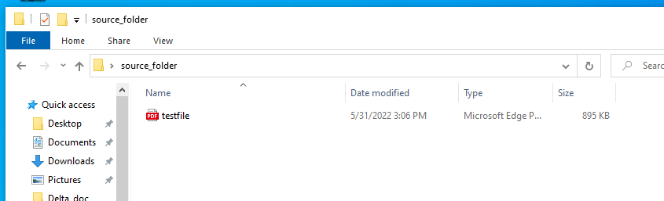
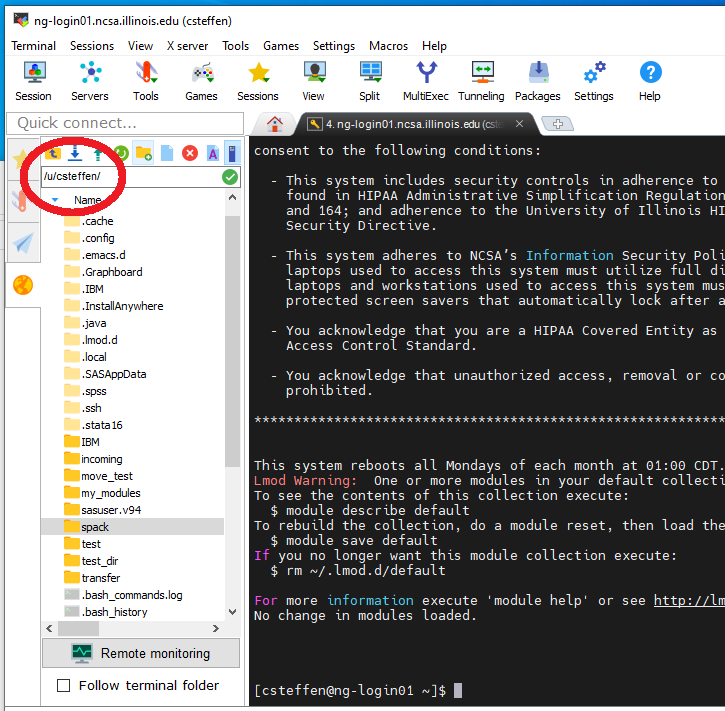
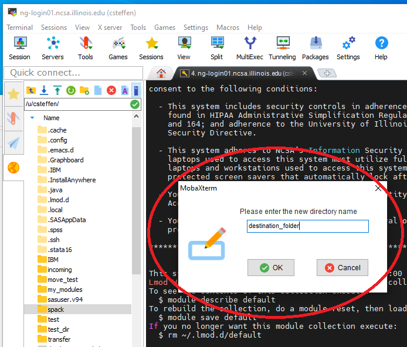
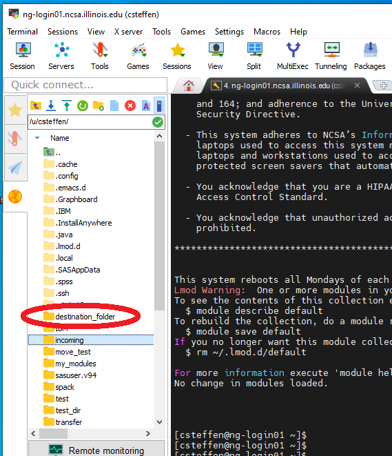
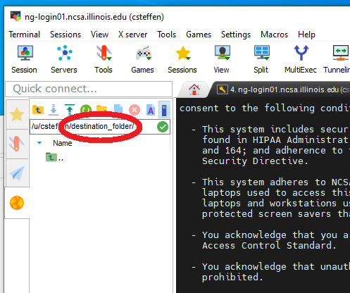
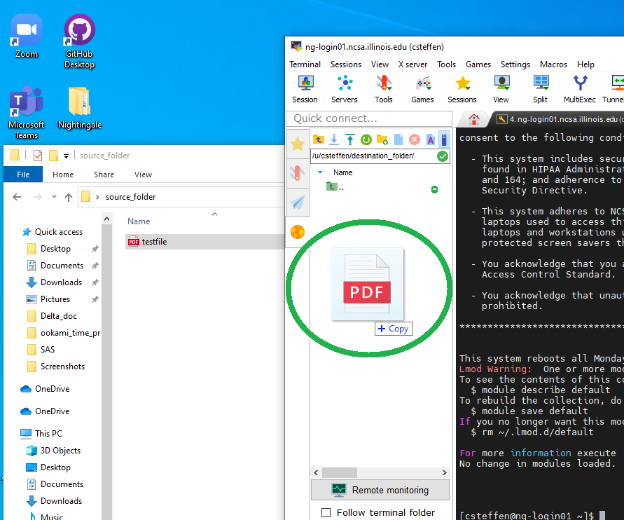
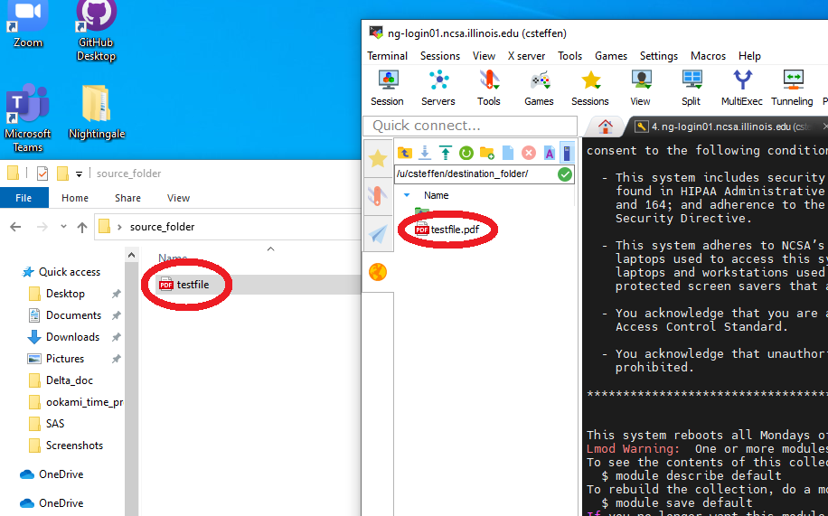

############################
File Transfer with MobaXterm 
############################

You may have files on your local system that you want to transfer to
Nightingale to use. These may be data files, or configuration program
files, or test files. Once you're logged in to Nightingale on Moba
Xterm, you can use Moba Xterm to transfer those files, just as if you
were copying them around your local machine.

Here, I'm starting with a test file on my local system:

The file is called "testfile.pdf" and it's it' folder "source_folder" on
my desktop.

Then open up Moba Xterm, and log into your node on Nightingale. if
you've set up the login configuration correctly (see the configuration
section above) then the left part of your Moba Xterm winodow will be a
list of folders and files, and the pathname of the folder will end with
**your** Nightingale username (circled in red) and a slash "/", as
below. If you don't see this, then something is configured wrong and
you'll have to back up.

It's often convenient to create a new folder if you're uploading files.
Click on the icon at the top of the left bar that's a folder with a
green "+" on it to create a new folder. Then you'll be asked to name it,
as below. I'm naming it "destination_folder".

Once you've created the destination folder, it will show up in the list
of folders. Here the folder I created is in the list.

Double-click the folder you want to upload files into. Here I've
double-clicked the folder above ("destination_folder"). To make sure
you're in the right place, verify that the end of the pathname at the
top of the left window is the name of the folder where you want to be.
See the circled pathname here; it ends with "destination_folder".

Now position the two windows so you can see them both. Grab the file on
your system that you want to move, and drag it to the file area in the
Moba Xterm window. As you move the file over the Moba Xterm window, if
it's working, it will light up with "+ Copy". Drop it there, and Moba
Xterm will take care of copying the file to Nightingale.

If everything works right, the (or files) will now exist on both
machines. You can now open the file, read it, and even modify it and
save it using software on Nightingale.

Downloading Files
------------------
own machine, you can download it, using essentially the reverse process
of uploading described above. Any files that you download **must**
legally clear to have on your machine; i.e. no identifying patient
information, etc. You would typically do this with summary statistics
data, but NOT original data.

You must be logged into Nightingale in the Moba Xterm application. If
you've set it up as on this page, on the left you'll see a file system
view of your directories on Nightingale. If you have a file that you've
exported on Nightingale, navigate to that file in the left window. You
can download it by right-clicking on it and selecting "copy", then going
to a directory on your own computer and right clicking and selecting
"paste". Or, you could drag the file from the Moba Xterm window onto a
directory folder that exists on your local computer. Either way, the
file will be copied.
