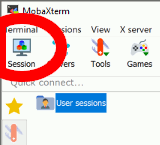
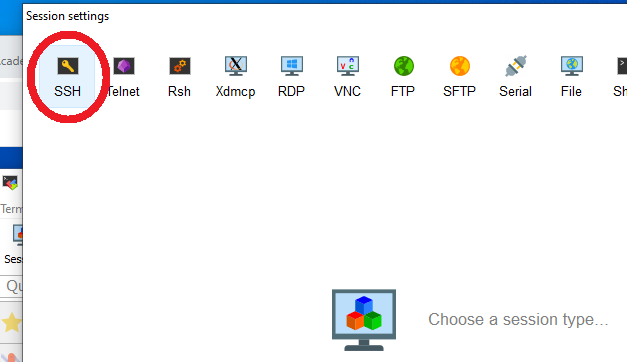
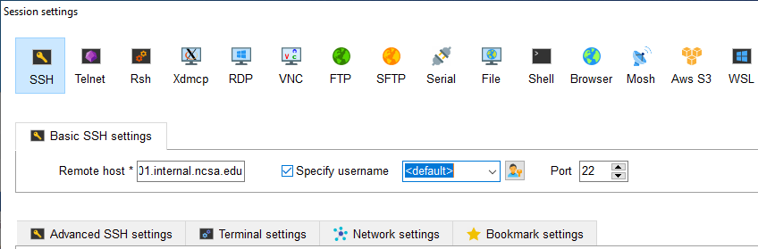
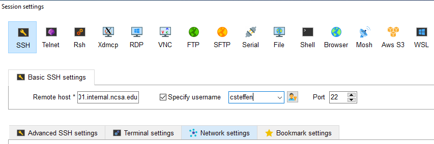
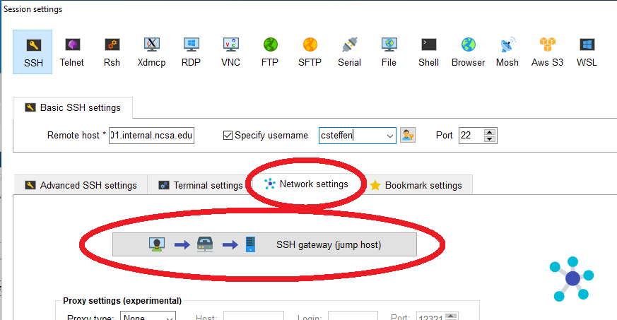
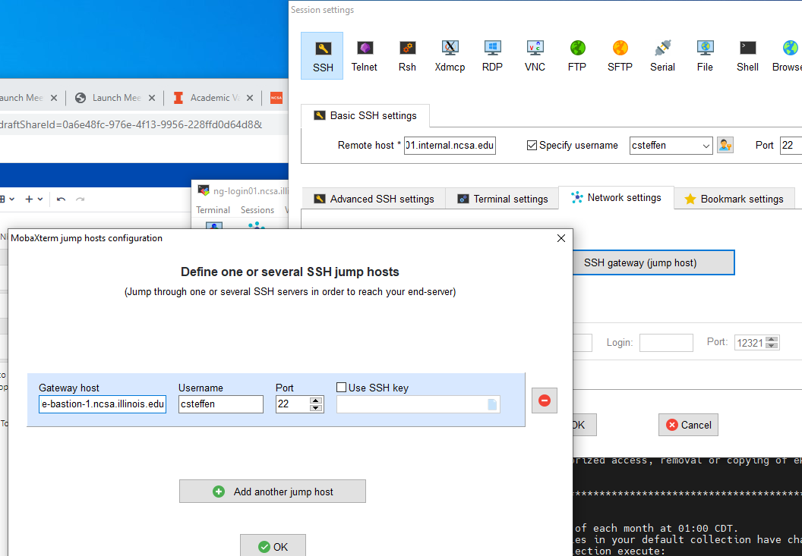

.. _access:

Accessing the System
=========================

Getting an Account
-------------------

To access Nightingale, your project needs to have a "project group" set up with access to Nightingale, and associated with the various resources that you need to use.  The project's Principle Investigator ("PI") sets up the project group, and the PI's user login account will be the first login accout attached to the project group.  The PI must have an NCSA Identity 
(username and password) or get one, and request access from Nightingale administrators.  This page covers that process.  The project PI will need to follow the process of creating the project group, and themselves go through the training process and be added to the HIPAA Covered Entity.  Other users on the project will just need to follow the training and Covered Entity process.  This page covers both processes.  

Create an NCSA Identity
~~~~~~~~~~~~~~~~~~~~~~~~~~

Before requesting Nightingale access, both PIs and individual users need an NCSA identity. You can skip this step if you already have an NCSA identity. 
If you don’t remember your password, you can reset it on the `NCSA Identity and Access Management webpage <https://identity.ncsa.illinois.edu/>`_.

- **To create an NCSA identity**, go to this `invite link <https://go.ncsa.illinois.edu/ngale_identity>`_

**Note:** In addition to creating a new account, this process will automatically enroll you into NCSA's Duo multi-factor 
authentication (https://go.ncsa.illinois.edu/2fa), which is required to log into Nightingale. (This is not the same as the University of Illnois's Duo.).  When you enroll in NCSA Duo, it's **very important** create and save two backup codes to use in case you lose your Duo device.  

Discuss Your Project With Nightingale Management
~~~~~~~~~~~~~~~~~~~~~~~~~~~~~~~~~~~~~~~~~~~~~~~~~~

(Individual users don't need to follow this step.).  Before getting your project added to the Nightingale system, a PI will need to discuss your project, its needs, your expectations, and what Nightingale access can get you.  To begin that conversation, please fill out `the NCSA XRAS <https://xras-submit.ncsa.illinois.edu/opportunities/531957/requests/new>`_.  Someone from the Nightingale project will contact you via email within a few days of filling out this form.  That person will begin the process of creating your project group.  

After your project group is created, Nightingale adminstirators will create your data storage directories and project group name.  The PI will find out about these steps via email.  Your group will be assigned an interactive node (shared or exclusive) to log into, and/or if you have batch system access, you will be assigned a "charge account" to assign your jobs to.  

Being Added to Nightingale Access
~~~~~~~~~~~~~~~~~~~~~~~~~~~~~~~~~~~

Both PIs creating a new project and individual users joining a project will need to follow these steps to get their user login accounts access to the Nightingale system.  

During that process, *you* will be responsible for:

* Becoming part of the NCSA HIPAA Covered Entity

  * this will involve taking training specific to the type of data that you'll be handling on Nightingale
  
  * you may need to submit your training certificate to a web form to become part of the covered entity

* Making sure all devices that you will log into Nightingale from have an encrypted hard drive

Logging Onto Nightingale
--------------------------

Once you have obtained an account on Nightingale, you can log on using an SSH (Secure Shell) client on your local desktop or laptop. 
Because of the added security for Nightingale, you will first log onto Nightingale's secure node and then log onto a general access login node 
or, for groups that have them, a specialized interactive node. The hostnames for these login nodes are listed below.

**Secure Node Hostname**::

   ngale-bastion-1.ncsa.illinois.edu 

**General Access Login Nodes Hostnames**::

   ng-login01.ngale.internal.ncsa.edu
   ng-login02.ngale.internal.ncsa.edu

**Specialized Interactive Node Hostname**::

   ng-<yourgroup>01.ngale.internal.ncsa.edu

where ng-<yourgroup>01 is the name of your allocation group. 

**Notes:** 

- Your principal investigator can inform you if your allocation has a specialized interactive node and its hostname.
- All Nightingale users have access to the general access login nodes. Please be aware that these nodes are a shared resource for all 
  system users, and you should limit your use of them to editing, compiling, and building your programs.

**General Log in Process**

You can log onto Nightingale by following these steps:

1. If not on campus, connect to the campus VPN. (`Instructions for installing the campus VPN <https://answers.uillinois.edu/illinois/98773>`_)
2. SSH to the secure node ngale-bastion-1.ncsa.illinois.edu.
3. Enter your NCSA username and password. (you will not see the characters you type for your password)
4. Enter '1' to send a push to the **NCSA Duo** app on your smartphone.
5. Approve the request on your phone.
6. SSH to your login node using the appropriate hostname (see above).

Below is a sample SSH command line to log into Nightingale's secure node where <username> is the username you created for your NCSA identity.::

   ssh <username>@ngale-bastion-1.ncsa.illinois.edu

After entering the ssh command, you will be prompted to enter your password, followed by a prompt to send a push to the Duo app (both of which you will not see on the screen). After you have approved the push, you will be at a prompt on ngale-bastion-1 node that will look similar to::

   [csteffen@ngale-bastion-1 ~]$

At the prompt, enter an SSH command using the hostname of your login node following this syntax:: 

   ssh <your_username>@ng-<yourgroup>01
   
For example, if your username is "hirop" and you group name is "biology" then your ssh command would look like this:: 

   ssh hirop@ng-biology03
   
In this case, you would been specifically told that "ng-biology03" would be your node to use for your computations.

The two commands above can be combined into one by specifying the bastion host as a "jump" host. The jump host is used to connect you to your destination node without you needing to interact with it. In this example, user "test1" can log into the Nightingale login node "login01" directly without logging into the bastion host first.::

   ssh -J test1@ngale-bastion-1.ncsa.illinois.edu test1@ng-login01

SSH Clients
------------

SSH (Secure Shell) is a client-server architecture that provides a secure channel over an unsecured network. An SSH client is a program for logging securely into and executing commands on a remote machine. SSH encrypts the data sent over an open network, such as the internet, so that it can’t be read by others.

Several SSH-based clients are available for accessing Nightingale. Which one you use depends on your workstation’s operating 
system. These are described in the sections below.

**Microsoft Windows**

You can use the built-in SSH Client in Windows (version 10 and above) or select from several freely available third-party SSH 
clients when using the Microsoft Windows operating system. These typically provide a Graphical User Interface rather than a 
command-line interface. `PuTTY <http://www.chiark.greenend.org.uk/~sgtatham/putty/>`_ is a popular choice, and
`MobaXterm <http://mobaxterm.mobatek.net/>`_ is another one.

**Mac OS X**

Mac OS X comes with a built-in open-source version of SSH called OpenSSH. You can access it via the Terminal application. 
`PuTTY <http://www.chiark.greenend.org.uk/~sgtatham/putty/>`_ is also available for Mac OS X.

**Linux**

The Linux operating system has SSH built into it. You use the Linux terminal application to connect via SSH. 
`PuTTY <http://www.chiark.greenend.org.uk/~sgtatham/putty/>`_ is also available for Linux.

Accessing Nightingale using a VPN
-----------------------------------

If you log into Nightingale from the University of Illinois campus, you don't need to use a VPN.  If you wish to access Nightingale from off campus, you will need to set up and activate a VPN ("Virtual Private Network") first.  A VPN sends your network traffic over an encrypted channel to a server on a different network, making your traffic origininate within that other network.  In this case, traffic will effectively originate inside of the University of Illinois, which adds an additional level of security and protection for your connection.  

There are two VPN services that will allow you to log into Nightingale from off campus.  The first is the University of Illinois VPN, which members of UIUC campus should use by default.  The other is the NCSA VPN, which is available for Nightingale users not associated directly with UIUC.  

If your login method just freezes when you try to log into Nightingale, this may be your problem.  Please try one of these methods.  

University of Illinois VPN
~~~~~~~~~~~~~~~~~~~~~~~~~~~~

If you're a member of the University of Illinois, you can use the `University of Illinois VPN service <https://answers.uillinois.edu/illinois/98773>`_.  You will need to authenticate to the VPN service itself using your University NetID, password, and 2FA.  

NCSA VPN
~~~~~~~~~

If you don't have a University of Illinois NetID, you will need to use the NCSA VPN, documented on
`this page <https://wiki.ncsa.illinois.edu/display/cybersec/Virtual+Private+Network+%28VPN%29+Service>`_
.  

As always, if you have trouble setting up or using either of these VPNs, or have questions, please do submit a ticket (:ref:`help`).  

Connecting with Terminal, ssh, and XQuartz (for users connecting from Mac OS machines)
----------------------------------------------------------------------------------------

One-time X-windows Software Install
~~~~~~~~~~~~~~~~~~~~~~~~~~~~~~~~~~~~

If you want to use an application from Nightingale and have its windows on your own computer, before logging in, install XQuartz on your Mac OS system.  You can `download it here <https://www.xquartz.org/>`_.  Most users of Nightingale will want to do this.  

One-time Ssh Configuration 
~~~~~~~~~~~~~~~~~~~~~~~~~~~~

Open the "Terminal" application on your mac.  That presents a black window to you that you can type commands into.  At the prompt, type "cd ~/.ssh" and then "return" or "enter" (in these instructions, "return" and "enter" are interchangable).  

Type "nano config" and hit return.  This will bring you into an editor program that looks like this:

::  

    UW PICO 5.09                            File: config                               

    ^G Get Help   ^O WriteOut   ^R Read File  ^Y Prev Pg    ^K Cut Text   ^C Cur Pos    
    ^X Exit       ^J Justify    ^W Where is   ^V Next Pg    ^U UnCut Text ^T To Spell   

This allows you to edit a configuration file that sets up connections to the outside world so you don't have to type as much all the time.  Cut the lines out of the following box, and then modify them in your window according to the instructions below the box. 

::

    Host ngb1
      HostName ngale-bastion-1.ncsa.illinois.edu
      ControlMaster auto
      ControlPath /tmp/ssh_mux_%h_%p_%r
      ControlPersist 5h
      User YOUR_USERNAME

    Host ng-login01
      HostName ng-login01.ngale.internal.ncsa.edu
      ProxyJump ngb1
      User YOUR_USERNAME

After pasting those lines into the file (using the arrow keys to position your cursor) edit where it says "YOUR_USERNAME" and replace it with your NCSA identity username.  Also, if you have an interactive node assigned to you, you can add another copy of the last stanza of the configuration file, and in that stanza, replace "ng-login01" with the name of *your* login node.  

So for example, a user with username "hirop" who was assigned node ng-gpu-x07 would have a configuration file something like the following.  

::

    Host ngb1
      HostName ngale-bastion-1.ncsa.illinois.edu
      ControlMaster auto
      ControlPath /tmp/ssh_mux_%h_%p_%r
      ControlPersist 5h
      User hirop

    Host ng-login01
      HostName ng-login01.ngale.internal.ncsa.edu
      ProxyJump ngb1
      User hirop
      
    Host ng-gpu-x07
      HostName ng-gpu-x07.ngale.internal.ncsa.edu
      ProxyJump ngb1
      User hirop
      
Once you have finished editing the file, it *Control*-o to write the file.  Hit enter to confirm the file name.  Then hit *Control*-x to exit the editor, and you're back at the prompt.  
      
Log Into Nightingale
~~~~~~~~~~~~~~~~~~~~~~
      
The above are one-time instructions to set up your computer for working on Nightingale.  To log into Nightingale to begin work, type the following at the prompt:

ssh -X ng-login01

(If you're logging into an interactive node, replace "ng-login01" with the name of that active node.)

You may see a message that begins "The authenticity of host...." and ends with "Are you sure you want to continue connecting (yes/no/[fingerprint])?".  You may safely type Y-E-S then enter.  

You'll be asked for a password.  Enter your NCSA (kerberos) password.  You **will not see your characters** echoed back to the screen; just type it blindly.  

Then you'll see a duo prompt asing for a passcode or for "option 1".  You may either type "1", then your phone Duo will ask you for login confirmation.  Or instead of 1, you may enter a 6-digit password from the **NCSA** entry of your Duo app.  

Then you'll be asked for your password again; that's again your NCSA password.  You again will not see it echoed to the screen; just type it blindly.  

You should now be at a propmt that reflects that you are on a Nightingale node.  You'll know this because the prompt (the bottom line in your termainl or ssh window) will contain the name of the machine you're working on, and that should beging with "ng-" for NightinGale".  It will look something like this: 

::

    [hirop@ng-gpu-m01 ~] $

You can load modules and run software and access your files from there.  

Connecting with MobaXterm (for users connecting from Windows machines)
------------------------------------------------------------------------

You can install `MobaXterm <https://mobaxterm.mobatek.net/>`_ on your 
workstation and use it to connect to Nightingale node using SSH. MobaXterm 
enables an SSH connection and provides other useful utilities you can use 
when communicating with a cluster, such as file transfer and editing.

Follow the steps below to install MobaXterm and connect to Nightingale. (Nightingale has extra security to protect the data stored on it, so configuring this connection is slightly more complicated than other HPC clusters. The difference involves adding the SSH connection to the secure bastion node. How to do this is described in Step 6 and 7.)

One-time setup
~~~~~~~~~~~~~~~

This section is the one-time setup on your Windows machine so that it can connect to Nightingale.  

**Step 1.** `Download MobaXterm <https://mobaxterm.mobatek.net/download-home-edition.html>`_ and install it on your Windows workstation. 

You can install either the Portable or Installer edition of MobaXterm. You will need to have admin privileges to install the Installer edition. The Portable edition does not require admin privileges and to use it just extract the downloaded zip file and click mobaxterm.exe.

**Step 2.** Launch the MobaXterm application and click the 'Session' button in the upper left of the window to start an SSH session.

**Step 3.** Select 'SSH' from the session types displayed and click the 'OK' button. 

**Step 4.** You will now see an area titled 'Basic SSH Settings.' 

**Step 5.** In the remote host text box, enter the name of the login node you want to access (either a general access or interactive node). Then check the box 'Specify username' and enter your NCSA Identity username as shown in the following example. 

**Step 6.** Next, click the "Network settings" tab and then click the "SSH gateway (jump host)" button.

**Step 7.** In the configuration window displayed, enter 
"ngale-bastion-1.ncsa.illinois.edu" in the "Gateway host" box and your NCSA username in the "Username" box. Then click the 'OK' button. (You may see a warning message saying that your remote host identification has changed. Go ahead and click the Yes button to continue.)

**Step 8.** You should now be back in the Session settings window. Click the 'OK' button to initiate your SSH connection. A terminal window will be displayed asking for your password. Enter your password and press return.

Logging Into Nightingale
~~~~~~~~~~~~~~~~~~~~~~~~~~

Once the above steps are complete, here's what you do each time you want to log into Nightingale to work.

Open up MobaXterm.  In the left bar, there's a list of "user sessions".  Each one is a node that you configured above for logging in.  Mouse over the Nightingale node you want to log into, right click, and in the resulting menu, select "execute". 

A window will pop up, asking for your password.  This is your NCSA password.  As you type it, you will see a row of "*********".  Hit enter or click "OK".

A second window will pop up asking for your 2FA code.  Open your Duo app, click on the "NCSA" entry (not the "University of Illinois" entry) and type the 6-digit code you see into the window.  As the password above, you will see it as ******.  

Then the screen will bring up a black window but without a prompt.  You may need to wait 30 seconds or a minute here.  Then it will ask you for your password.  You will type your NCSA password again.  **It will not echo the characters back; you must type it blind**.  

Then you should have a prompt at the bottom, and a file window on the left showing your directories on Nightingale, and you're ready to work.  

Account Administration
------------------------

On Nightingale there is an approval process for adding users to the system. To start the process, contact `help@ncsa.illinois.edu <mailto:help@ncsa.illinois.edu>`_.

Other account and project administration tasks, such as resetting your password, are 
managed by the NCSA Identity and Group Management tools. Please see the 
`NCSA Allocation and Account Management documentation page <https://wiki.ncsa.illinois.edu/display/USSPPRT/NCSA+Allocation+and+Account+Management>`_ for more information.
